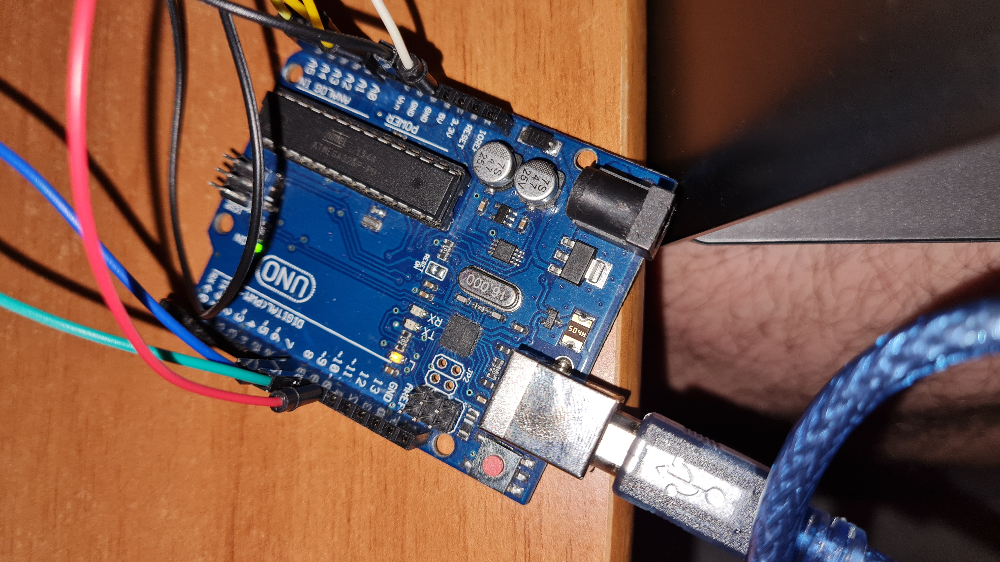

# Introduction To Robotics

<h3> Author:&nbsp;&nbsp;Ristea Mihai Cristian
<h3> Contact: mihai.ristea@s.unibuc.ro
<h3>&nbsp;&nbsp;&nbsp;&nbsp;This repository contains the summary of homeworks and projects done as part of the "Introduction To Robotics" laboratory.
<h2> &nbsp;&nbsp;&nbsp;&nbsp;&nbsp;&nbsp;Homework #0:
<h3>https://github.com/JustMike13/IntroductionToRobotics/
<h2> &nbsp;&nbsp;&nbsp;&nbsp;&nbsp;&nbsp;Homework #1:
<h3>Technical Task: Use a separate potentiometer in controlling each of the color of the RGB led (Red,Green andBlue). The control must be done with digital electronics (aka you must read the value of the potentiometer with Arduino, and write a mapped value to each of the pins connected to the led).
<h3>Components: RBG led (1 minimum), potentiometers (3 minimum), resistors and wires (per logic).
  
  
  
